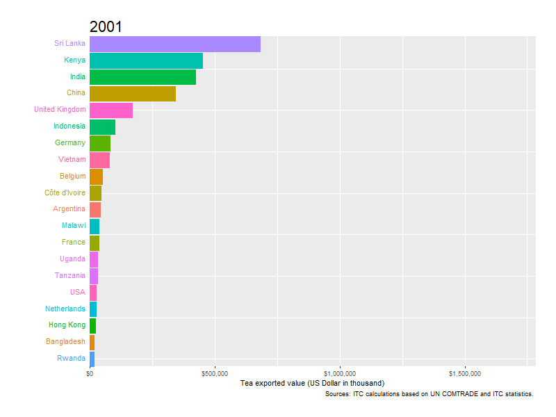

<!-- README.md is generated from README.Rmd. Please edit that file -->
tea
===

R package for tea exported data.

Installation
------------

``` r
#install.packages("devtools")
devtools::install_github("thiyangt/tea")
library(tea)
```

Usage
-----

``` r
library(tea)
head(tea)
#>   Exporters   2001   2002   2003   2004   2005   2006    2007    2008
#> 1     China 342028 331761 367187 436845 484211 546915  604033  682248
#> 2     Kenya 448742 140939 481210 462110 566361 661209  698213  931582
#> 3     India 422932 324294 313381 381624 385483 415287  433340  560493
#> 4 Sri Lanka 680029 650407 672587 730216 803678 873488 1017027 1258557
#> 5   Germany  78868  90049 105291 131951 142045 160315  173245  206782
#> 6    Poland   9858  13919  15421  24620  28960  28501   44098   64752
#>      2009    2010    2011    2012    2013    2014    2015    2016    2017
#> 1  704947  784145  965080 1042116 1246308 1272663 1381530 1485022 1609960
#> 2  893984 1163630 1157326 1205020 1217573 1071451 1248739 1229106 1424429
#> 3  554326  694852  865427  685456  816055  656214  677933  661719  768994
#> 4 1175677 1366815 1475038 1403154 1528519 1609339 1321899 1251730 1513207
#> 5  186318  194433  227114  222871  250827  252089  217132  232732  249533
#> 6   60002   75225  141864  172177  208849  235865  182550  194591  201139
#>      2018
#> 1 1785365
#> 2  857771
#> 3  763192
#> 4  690307
#> 5  252018
#> 6  202314
```

\*\* Top tea exporting countries \*\*

``` r

library(tea)
library(gganimate)
#> Loading required package: ggplot2
library(tidyverse)
#> -- Attaching packages --- tidyverse 1.2.1 --
#> v tibble  2.1.1       v purrr   0.3.2  
#> v tidyr   0.8.3       v dplyr   0.8.0.1
#> v readr   1.3.1       v stringr 1.4.0  
#> v tibble  2.1.1       v forcats 0.4.0
#> -- Conflicts ------ tidyverse_conflicts() --
#> x dplyr::filter() masks stats::filter()
#> x dplyr::lag()    masks stats::lag()

## Processing data
tea_export <- tea %>%
  gather(Year, Value, "2001":"2018", factor_key=TRUE) %>% 
  group_by(Year) %>%
  mutate(rank = min_rank(-Value) * 1) %>%
  ungroup() %>%
  filter(rank <= 20)

## Visualization
tea_plot <- ggplot(tea_export, aes(rank, group = Exporters, 
                     fill = as.factor(Exporters), color = as.factor(Exporters))) +
  geom_tile(aes(y = Value,
                height = Value,
                width = 0.9), alpha = 0.8, color = NA) +
  geom_text(aes(y = 0, label = paste(Exporters, " ")), vjust = 0.2, hjust = 1) +
  coord_flip(clip = "off", expand = FALSE) +
  scale_y_continuous(labels = scales::comma) +
  scale_x_reverse() +
  guides(color = FALSE, fill = FALSE) +
  labs(title='{closest_state}', x = "", y = "Tea export value (US Dollar in thousand)") +
  theme(plot.title = element_text(hjust = 0, size = 22),
        axis.ticks.y = element_blank(),  
        axis.text.y  = element_blank(),  
        plot.margin = margin(1,1,1,4, "cm")) +
  transition_states(Year, transition_length = 4, state_length = 1) +
  ease_aes('cubic-in-out')

animate(tea_plot, fps = 25, duration = 20, width = 800, height = 600)
```


